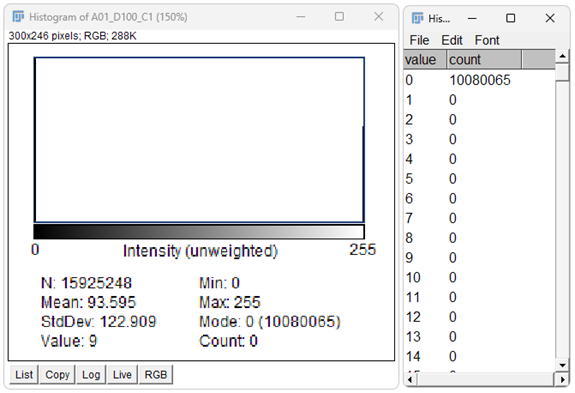
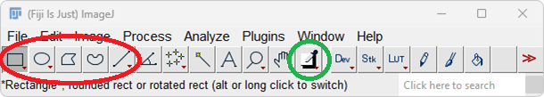

## 1. Installation of FIJI:

1. Download and install FIJI (FIJI is just ImageJ)
   * Download link for PC and MAC: [https://imagej.net/software/fiji/downloads](https://imagej.net/software/fiji/downloads)
   * If you have FIJI already installed, make sure, it is up to date: Help › Update...
3. Open Fiji, it should look like this:

## Use Macro to analyze multiple images

1. Perform a color threshold as you would do without macro (see step 3 above) and note down the numbers, you used. The result and color threshold window can be discarded, you will only need the numbers.
1. Drag and drop the macro file on to the FIJI Window and press the 'Run' button in the popped-up window.
1. Enter the numbers from Step 1 in to the dialog window
1. From now on follow the instructions given by the Macro.
   * Read the dialogs carefully!
   * All numerical result will be printed in the Log-window, save it then you finished your analysis!

## Canopy Coverage analysis with FIJI (without Macro):

### Perform a perspective correction
1. Open your clearly named canopy coverage image by drag and drop or File › Open
2. Plugins › Transform › Interactive Perspective
   * Four small plus signs should appear on the image, drag them across the image until the frame is just outside the field of view.
   * Confirm with ENTER

### Isolate the green plants with a color threshold
1. Image › Adjust › Color Threshold...
   1. Set all filters to 'Pass'
   2. Thresholding method: Default
   3. Threshold color: B&W
   4. Color space: HSB
   5. Dark background: enabled
2. Set Hue, Saturation and Brightness, so only plants are white and anything else is black.

 

### Create a histogram for the black and white image
1. Select the image
1. Duplicate the image: Image › Duplicate... (Ctrl + Shift + D)
1. Analyze › Histogram (Ctrl + H)
2. Press 'List' on the Histogram Window (red in the picture below)
3. Note down the count for value=0 (background) and value=255 (canopy)
4. Calculate the canopy coverage

### Erase all weeds from the RGB image (created in step 4.b)
1. Double click on the color picker (green in the picture below) and select black as background color.
1. Use the selection tools from Fiji (red in the picture below) to select one weed or a group of weeds at a time, when selected press the del key. The weeds should now be replaced by solid black color.

1. Repeat, until there are no visible weeds left
1. You can reverse the last deletion with Cntr + Z

### Preform steps 3 and 4 again for the image without weeds and calculate the weed coverage from the difference.